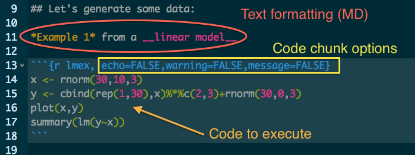

## What you'll learn

### Markdown 
+ A stupidly simple language for writing.

### knitr
+ A simple way to write reproducible documents including R code blocks and text.

---

## What is Markdown?

> ### Markdown is a text-to-HTML conversion tool ~~for web writers~~. Markdown allows you to write using an easy-to-read, easy-to-write plain text format, then convert it to ~~structurally valid XHTML (or HTML)~~ other file formats.

<br><br><br>

from [the Markdown site](http://daringfireball.net/projects/markdown/)

---

## Markdown use cases

### Taking notes
### Blog posts
### Research papers
### Conversing on the web

---

## Throw away Word and pick up MD

| Markdown            | Word          | 
| ------------- |:-------------:|
| Super simple to learn - The syntax is dead simple      | Simple, okay, i'll give you that |
| Widely supported on the web (StackOverflow, GitHub, pandoc, static webpages, etc..)      | Not supported on the web      |
| Versioning? Can at least partly due as it's plain text | Can't version binary files  |
| Open in your favorite editor? heck yes | Sorry, only Word and OpenOffice (sorta works) |
| Execute code inside the document? Yep! |  Sorry, what does that mean? |
| easy | okay, also easy |
| free | h*%ll no |

--- &twocol

## Markdown - Syntax

*** =left

> + Headings (#, or put = or - under words)
  + ### This is a Heading 3
> + Blockquote (> Put your quote here after the carrot)
> + Lists
  + Create list using *, +, or -
  + Ordered list using 1., 2., etc.
  + Nested lists, and more, see the MD site
  
*** =right

> + Emphasis
  + __Bold__ \*\*bold\*\* or \_\_bold\_\_
  + _Italic_ *italic* or \_italic\_
  + In the middle of a world: un\*\*believe\*\*able
> + Links, like this => []() or [][] with []: url somewhere else
  + e.g., [here is a link](http://ropensci.org/)

---

<!-- Scott do live typing of MD w/ probably Marked app showing how the MD gets rendered live.
see file scott_demo.md -->

<br><br><br><br>
<center> 
## <i class="icon-pencil"></i> Live demo 
</center> 

---

## <i class="icon-keyboard"></i> Markdown exercizes - your turn

<br><br><br><br>

### Create something in MD and view it.  
<br><br>
### Try and hit as many stylistic elements as possible.

--- &twocol

## More Markdown

*** =left

### Images

\!\[\](http://example.com/logo.png)

\!\[\](figures/img.png)

### Inline code

Wrap code to execute in backticks, so "1 + 1" is executed within this sentence

I counted 2 red trucks on the highway.

### Code blocks

+ Indent 1 tab or 4 spaces
+ Or wrap block like in three backticks ```

*** =right

### Strikethrough

Use double tildas \~\~strikethrough\~\~ to get ~~strikethrough~~

### Tables

```
First Header  | Second Header
------------- | -------------
Content Cell  | Content Cell
Content Cell  | Content Cell
```

First Header  | Second Header
------------- | -------------
Content Cell  | Content Cell
Content Cell  | Content Cell

--- &twocol

## You can always just write html! Here's an html table

***=left

```{bash eval=FALSE}
  <table>
      <tr>
          <td>Foo</td>
          <td>Bar</td>
      </tr>
      <tr>
          <td>5</td>
          <td>6</td>
      </tr>
      <tr>
          <td>3</td>
          <td>2</td>
      </tr>
      <tr>
          <td>8</td>
          <td>9</td>
      </tr>
  </table>
```
  
***=right

  <table>
      <tr>
          <td>Foo</td>
          <td>Bar</td>
      </tr>
      <tr>
          <td>5</td>
          <td>6</td>
      </tr>
      <tr>
          <td>3</td>
          <td>2</td>
      </tr>
      <tr>
          <td>8</td>
          <td>9</td>
      </tr>
  </table>

---

## [knitr](http://yihui.name/knitr/) 


<center><strong>Elegant, flexible and fast dynamic report generation with R</strong></center>

<center>
<i class="icon-code icon-4x"> +</i> <i class="icon-pencil icon-4x"> =</i> <i class="icon-smile icon-4x"></i>
</center>

---

## knitr - R code blocks in Markdown

Put executable code blocks in your markdown


```r
foo <- function() {
    print("bar")
}

foo()
```

```
## [1] "bar"
```


Sweet! <i class="icon-thumbs-up-alt"></i>

---

## Anatomy of a code chunk
<br>
<br>
<center></center>
<br>
Three basic components of a knitr document

1. Markdown formatted text

2. Code chunk designation and options

3. Code to execute

---

## <i class="icon-keyboard"></i> Markdown exercizes - your turn again, with code this time

<br><br><br><br>

1. Write markdown with code in code blocks without executing the code in a **.md** file. 

2. Then, put your markdown text w/code blocks in R in a **.Rmd** file, and compile document using knitr, like 


```r
library(knitr)
knit("/path/to/your/file")
```


or just press **Knit HTML** button above your file

---
## Working with code chunk options

Some options

+ `eval`: T or F
  + Evaluate a chunk or just print it
+ `fig.width`, `fig.height`: numeric
  + Width and height of the plot in inches
+ `message`, `warning`, `error`: T or F
  + Whether or not to display messages, warnings or errors

RStudio has a helpful autocomplete for code chunk options

Here's a [full list of options](http://yihui.name/knitr/options)

---

## <i class="icon-keyboard"></i> Markdown exercizes - With code and options

<br><br><br><br>

1. Take your previous example and add some code chunk options.

2. Compile document using knitr.


--- 

## Citations
<!-- Not sure if this should go before or after the next slide -->

### BibTex file with keys, e.g.:
@article{jones2006,
  title={The new bioinformatics: integrating ecological data from the gene to the biosphere},<br>
author={Jones, Matthew B and Schildhauer, Mark P and Reichman, OJ and Bowers, Shawn},<br>
journal={Annual Review of Ecology, Evolution, and Systematics}
<br>
### How it appears

**In Markdown**

"because they do not follow best practices in terms of data structure, metadata, and licensing [@jones2006]."

**Rendered as PDF**

"because they do not follow best practices in terms of
32 data structure, metadata, and licensing (Jones et al. 2006)."

**Citation**

Jones, M. B., M. P. Schildhauer, O. J. Reichman, and S. Bowers. 2006. The new bioinformatics:integrating ecological data from the gene to the biosphere. Annual Review of Ecology, Evolution,and Systematics:519–544.

---

## Convert knitr documents to other formats

<!-- Will go through examples of some of these on the CLI, etc. -->

+ Markdown - using knitr


```r
knit("knitr_eg.Rmd")
```


+ HTML - using knitr


```r
knit2html("knitr_eg.Rmd")
```


+ PDF - You have to go to the command line for this (though you can go from LaTeX to PDF)

```bash
pandoc -o knitr_eg.pdf knitr_eg.md
pandoc -V geometry:margin=1in -o knitr_eg.pdf knitr_eg.md
```

+ LaTeX - Requires a bit of text for proper latex doc

```bash
pandoc -o knitr_eg.tex knitr_eg.md
```

---
<br><br><br>
## Karthik

--- &twocol

***=left

## markdown resources

+ How do I write MD? See [here](http://daringfireball.net/projects/markdown/)
+ Has anyone used MD to write a paper? Yep, see these
  + [Ethan White et al. 2013](https://github.com/weecology/data-sharing-paper/blob/master/data_sharing_ms.md)
  + [Ram 2013](https://github.com/karthikram/smb_git/)
+ Will MD gain more features? Yep, see [here](https://github.com/scholmd/scholmd)
+ Where else can I write MD?
  + [DraftIn](https://draftin.com/) - collaborative writing on the web in MD
+ [MD cheat sheet](https://github.com/adam-p/markdown-here/wiki/Markdown-Cheatsheet)
+ pandoc [get it here](http://johnmacfarlane.net/pandoc/)

***=right

## knitr resources

+ How do I use knitr? See [here](http://yihui.name/knitr/)
+ Can I just see some minimal examples? See [here](http://yihui.name/knitr/demo/minimal/)
+ But I want to see a video. See [here](http://yihui.name/knitr/)

## git resources

+ How do I use git? See [here](http://git-scm.com/book)
+ But, I want to watch videos! Okay, see [here](https://www.youtube.com/channel/UCP7RrmoueENv9TZts3HXXtw) 

---

## Cred

+ Slides made with [Slidify](http://slidify.org/), written in Markdown!
+ Icons by [FontAwesome](http://fortawesome.github.io/Font-Awesome)

---

## rOpenSci Drinkup

###  Location: Brit's Pub, 3rd floor Verandah bar. 6:30 pm.

<center></center>

Generously supported by <icon class="icon-github"></i> [GitHub](https://github.com/)
