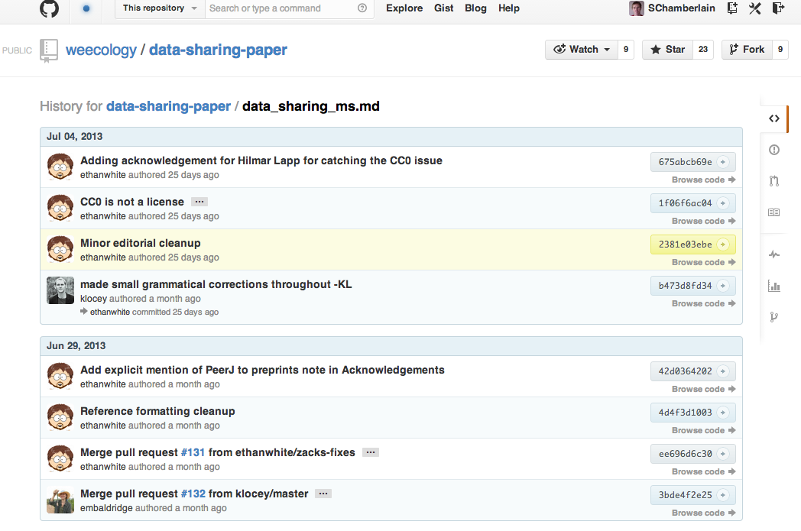

---

## Why git? Who did what?

---

## Why git? Visualize contributions

---

## MD + git: Changes by each author can be tracked

---

## MD + git: Highlight easily what changed

---

## git - your turn

> + If you have git installed:
  + Create a folder `foo <- bar(the = 5)`
  + Create a document inside that folder with some markdown text `touch mydoc.md`
  + Initiate the git repo `git init`
  + Tell git to track your file `git add .` or `git add mydoc.md`
  + Commit those changes `git commit -a -m 'initial commit, added mydoc file'`
  + Make some additional changes to your file
  + Commit those changes `git commit -a -m 'edited mydoc file'`
  + Create a branch `git branch newbranch` then `git checkout newbranch`
  + Make a few changes to the file on the new branch and commit `git commit -a -m '...'`
  + Merge the new branch into the master branch `git checkout master` & `git merge newbranch`

---

## Resources for git, via FAQ

> + git
  + How do I use git? See [here](http://git-scm.com/book)
  + But, I want to watch videos! Okay, see [here](https://www.youtube.com/channel/UCP7RrmoueENv9TZts3HXXtw)
  + How do I ...